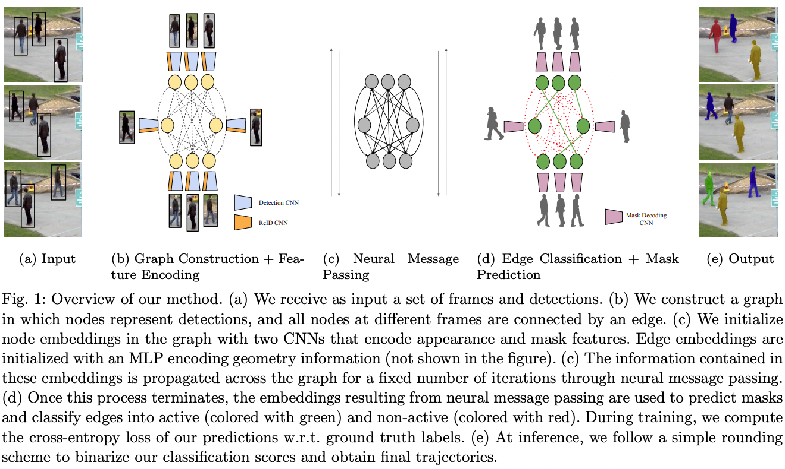

# Multi-Object Tracking and Segmentation via Neural Message Passing

This the official implementation of our **IJCV 2022** paper *Multi-Object Tracking and Segmentation via Neural Message Passing* ([Guillem Brasó*](https://dvl.in.tum.de/team/braso/), [Orcun Cetintas*](https://dvl.in.tum.de/team/cetintas/), [Laura Leal-Taixe](https://dvl.in.tum.de/team/lealtaixe/)) 

This work builds upon our previous **CVPR 2020 (oral)** paper [*Learning a Neural Solver for Multiple Object Tracking*](https://arxiv.org/abs/1912.07515)
and extends it by: 
1) integrating an attentive module to our neural message passing scheme to yield a unified model for multi-object tracking and segmentation 
2) providing an extensive evaluation of our tracking model over three challenging datasets, including MOT20, KITTI and the recently proposed Human in Events dataset.

[[Paper]](tbd)


## Setup

1. Clone and enter this repository:
   ```
   git clone https://github.com/ocetintas/MPNTrackSeg.git
   cd MPNTrackSeg
   ```

2. Put the project directories in PYTHONPATH by copying the following lines in your .bashrc file:
   ```
    export PYTHONPATH="${PYTHONPATH}:[PATH_TO_YOUR_PROJECT]/MPNTrackSeg/src"
    export PYTHONPATH="${PYTHONPATH}:[PATH_TO_YOUR_PROJECT]/MPNTrackSeg/MOTChallengeEvalKit/src"
    export PYTHONPATH="${PYTHONPATH}:[PATH_TO_YOUR_PROJECT]/MPNTrackSeg/tracktor-mots/src"
   ```

3. Create an [Anaconda environment](https://docs.conda.io/projects/conda/en/latest/user-guide/tasks/manage-environments.html) for this project:
    1. `conda env create -f environment.yml`
    2. `conda activate MPNTrackSeg`


4. Modify the variables `DATA_PATH`, and `OUTPUT_PATH` in  `src/mot_neural_solver/path_cfg.py` so that they are set to
your preferred locations for storing datasets and output results, respectively.

5. Download [MOTS20](https://motchallenge.net/data/MOTS/) and/or [KITTIMOTS](https://www.vision.rwth-aachen.de/page/mots) datasets. Expected folder structure: 

    ```
    DATA_PATH
    ├── KITTIMOTS
    │   └── ...
    └── MOTS20
        └── train
        │    ├── MOTS20-02
        │    │   ├── det
        │    │   │   └── det.txt
        │    │   └── gt
        │    │   │   └── gt.txt
        │    │   └── img1 
        │    │   │   └── ...
        │    │   └── seqinfo.ini
        │    └── ...
        └── test
            └── ...

    ```

6. (**OPTIONAL**) We provide our trained models and detections:

    1. [[Models]](https://drive.google.com/file/d/1wjMTZnND3w7OtmSiJiKlp1tMc_TGOgUX/view?usp=sharing)
    
        Default folder structure is: 

        ```
        MPNTrackSeg
        └── output
                └── trained_models
                    └── mots
                    │    ├── kitti.ckpt
                    │    └── mots20.ckpt
                    └── reid
                        └── resnet50_market_cuhk_duke.tar-232

        ```

    2. [[Detections]](https://drive.google.com/file/d/1xdMAQLnM06MkawgaNCHr9OPuIJk3HUQB/view?usp=sharing)

        Default location for each detections file is under det folder for each sequence with the naming det.txt (See step 5)


## Training
Specify hyperparameters via [tracking_cfg.yaml](https://github.com/ocetintas/MPNTrackSeg/blob/main/configs/tracking_cfg.yaml) and choose train and validation splits via [train.py](https://github.com/ocetintas/MPNTrackSeg/blob/main/scripts/train.py#L39). 
```
python scripts/train.py
```

## Evaluation
Specify hyperparameters via [tracking_cfg.yaml](https://github.com/ocetintas/MPNTrackSeg/blob/main/configs/tracking_cfg.yaml) and choose the trained model via [evaluate.py](https://github.com/ocetintas/MPNTrackSeg/blob/main/scripts/evaluate.py#L22). Our hyperparameters for MOTS20 and KITTIMOTS datasets are provided under configs folder. 
```
python scripts/evaluate.py
```

## Citation
 If you use our work in your research, please cite our publications:

 1. Multi-Object Tracking and Segmentation via Neural Message Passing (IJCV 2022)

    ```
         @article{MPNTrackSeg,
         author = {Bras{\'o}, Guillem and Cetintas, Orcun and Leal-Taix{\'e}, Laura},
         date = {2022/09/26},
         doi = {10.1007/s11263-022-01678-6},
         id = {Bras{\'o}2022},
         isbn = {1573-1405},
         journal = {International Journal of Computer Vision},
         title = {Multi-Object Tracking and Segmentation Via Neural Message Passing},
         url = {https://doi.org/10.1007/s11263-022-01678-6},
         year = {2022}}
    ```
2. Learning a Neural Solver for Multiple Object Tracking (CVPR 2020)

    ```
        @InProceedings{braso_2020_CVPR,
        author={Guillem Brasó and Laura Leal-Taixé},
        title={Learning a Neural Solver for Multiple Object Tracking},
        booktitle = {The IEEE Conference on Computer Vision and Pattern Recognition (CVPR)},
        month = {June},
        year = {2020}
    }
    ```

## Acknowledgements
We use the codebases of [Tracktor](https://github.com/phil-bergmann/tracking_wo_bnw) for preprocessing and [MOTChallengeEvalKit](https://github.com/dendorferpatrick/MOTChallengeEvalKit) and [TrackEval](https://github.com/JonathonLuiten/TrackEval) for evaluation. We thank the authors of these codebases for their great work!
